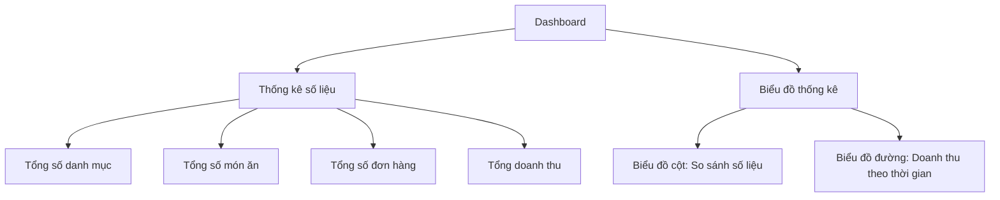
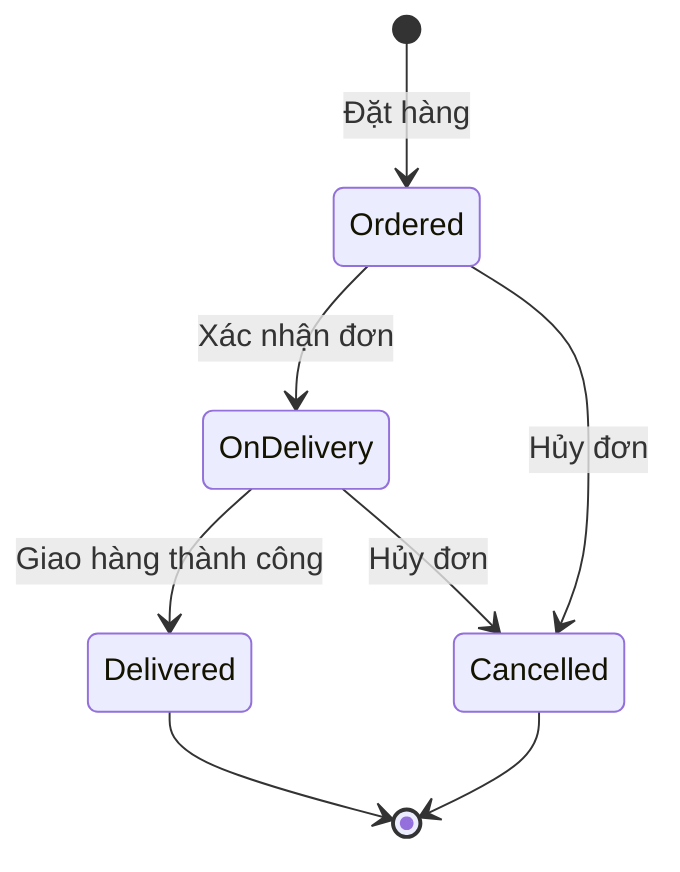
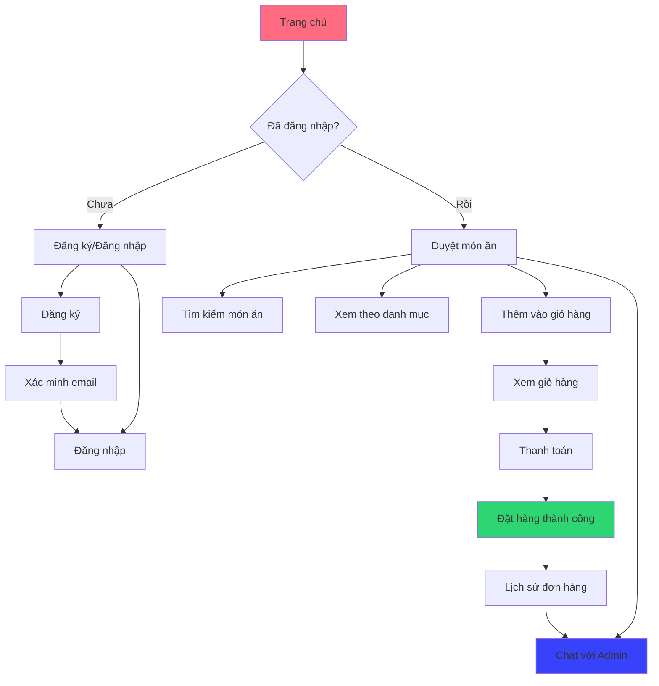
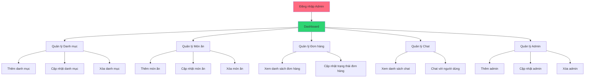
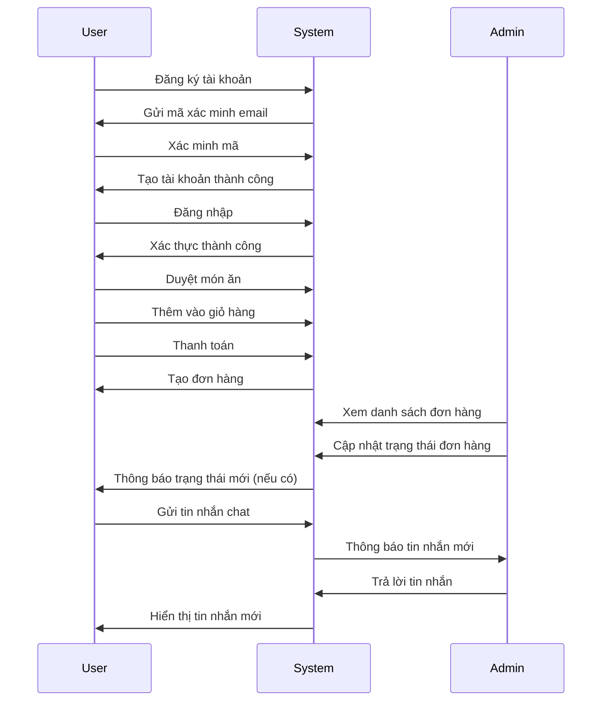

# 5.1 Thiết kế chức năng

## Mục lục
1. [Thiết kế chức năng phía người dùng](#1-thiết-kế-chức-năng-phía-người-dùng)
2. [Thiết kế chức năng phía quản trị viên](#2-thiết-kế-chức-năng-phía-quản-trị-viên)

---

## 1. Thiết kế chức năng phía người dùng

### 1.1. Quản lý tài khoản người dùng

#### 1.1.1. Đăng ký tài khoản
**Mô tả:** Người dùng có thể đăng ký tài khoản mới để sử dụng hệ thống.

**Chức năng:**
- Form đăng ký với các trường: Họ tên, Email (chỉ chấp nhận Gmail), Mật khẩu, Xác nhận mật khẩu, Số điện thoại, Địa chỉ
- Validation dữ liệu đầu vào:
  - Email phải là định dạng Gmail (@gmail.com)
  - Mật khẩu tối thiểu 6 ký tự
  - Mật khẩu và xác nhận mật khẩu phải khớp
- Xác minh email qua mã 6 số:
  - Tạo mã xác minh ngẫu nhiên 6 chữ số
  - Gửi mã qua email sử dụng PHPMailer (Gmail SMTP)
  - Mã có thời hạn 10 phút
  - Lưu mã vào database với trạng thái chưa xác minh
- Hash mật khẩu bằng `password_hash()` trước khi lưu vào database
- Kiểm tra email đã tồn tại trong hệ thống

**File liên quan:**
- `user/register.php` - Form đăng ký và xử lý đăng ký
- `user/verify-code.php` - Xác minh mã OTP
- `api/send-verification.php` - API gửi mã xác minh
- `api/phpmailer-send.php` - Xử lý gửi email

**Luồng xử lý:**
```
Người dùng nhập thông tin → Validate → Kiểm tra email tồn tại → 
Tạo mã OTP → Gửi email → Lưu thông tin tạm vào session → 
Chuyển đến trang xác minh → Nhập mã OTP → Xác minh → 
Tạo tài khoản → Đăng nhập tự động
```

#### 1.1.2. Đăng nhập
**Mô tả:** Người dùng đăng nhập vào hệ thống bằng email và mật khẩu.

**Chức năng:**
- Form đăng nhập với Email và Mật khẩu
- Xác thực thông tin đăng nhập:
  - Kiểm tra email tồn tại trong database
  - Kiểm tra tài khoản có trạng thái Active
  - Xác thực mật khẩu bằng `password_verify()`
- Lưu thông tin user vào session:
  - `user_id` - ID người dùng
  - `user` - Tên đăng nhập
  - `user_full_name` - Họ tên đầy đủ
- Redirect thông minh:
  - Nếu có `redirect_food_id` trong session → chuyển đến trang đặt hàng
  - Ngược lại → chuyển về trang chủ
- Hiển thị thông báo lỗi nếu đăng nhập thất bại

**File liên quan:**
- `user/login.php` - Form đăng nhập và xử lý đăng nhập

#### 1.1.3. Quên mật khẩu
**Mô tả:** Người dùng có thể khôi phục mật khẩu nếu quên.

**Chức năng:**
- Form nhập email để yêu cầu đặt lại mật khẩu
- Gửi mã xác minh 6 số qua email
- Giới hạn số lần thử nhập mã (5 lần)
- Mã xác minh có thời hạn 10 phút
- Form đặt lại mật khẩu mới sau khi xác minh thành công
- Hash mật khẩu mới trước khi cập nhật

**File liên quan:**
- `user/forgot-password.php` - Form quên mật khẩu
- `user/reset-password.php` - Form đặt lại mật khẩu
- `user/verify-code.php` - Xác minh mã OTP

**Luồng xử lý:**
```
Nhập email → Gửi mã OTP → Nhập mã → Xác minh → 
Đặt mật khẩu mới → Cập nhật database → Thông báo thành công
```

#### 1.1.4. Đăng xuất
**Mô tả:** Người dùng có thể đăng xuất khỏi hệ thống.

**Chức năng:**
- Xóa tất cả session của người dùng
- Chuyển hướng về trang chủ
- Hiển thị thông báo đăng xuất thành công

**File liên quan:**
- `user/logout.php` - Xử lý đăng xuất

---

### 1.2. Duyệt và tìm kiếm món ăn

#### 1.2.1. Trang chủ
**Mô tả:** Hiển thị thông tin tổng quan về hệ thống và món ăn nổi bật.

**Chức năng:**
- Hiển thị form tìm kiếm món ăn
- Hiển thị 3 danh mục đầu tiên với hình ảnh
- Hiển thị 6 món ăn đầu tiên trong menu
- Mỗi món ăn hiển thị: Tên, Giá, Mô tả, Hình ảnh
- Nút "Thêm vào giỏ" nếu đã đăng nhập, "Đặt ngay" nếu chưa đăng nhập
- Link "Xem tất cả món ăn" để xem toàn bộ menu

**File liên quan:**
- `index.php` - Trang chủ

#### 1.2.2. Xem danh sách món ăn
**Mô tả:** Hiển thị toàn bộ món ăn trong hệ thống.

**Chức năng:**
- Hiển thị tất cả món ăn có trong database
- Mỗi món ăn hiển thị đầy đủ thông tin: Tên, Giá, Mô tả, Hình ảnh
- Nút thêm vào giỏ hàng (yêu cầu đăng nhập)
- Responsive design cho mobile

**File liên quan:**
- `food.php` - Trang danh sách món ăn

#### 1.2.3. Xem món ăn theo danh mục
**Mô tả:** Lọc và hiển thị món ăn theo từng danh mục.

**Chức năng:**
- Hiển thị danh sách tất cả danh mục
- Khi click vào danh mục, hiển thị các món ăn thuộc danh mục đó
- Hiển thị thông báo nếu danh mục chưa có món ăn

**File liên quan:**
- `categories.php` - Trang danh sách danh mục
- `category-food.php` - Trang món ăn theo danh mục

#### 1.2.4. Tìm kiếm món ăn
**Mô tả:** Tìm kiếm món ăn theo từ khóa.

**Chức năng:**
- Form tìm kiếm với ô nhập từ khóa
- Tìm kiếm trong tên món ăn (`title`) và mô tả (`description`)
- Hiển thị kết quả tìm kiếm với đầy đủ thông tin món ăn
- Hiển thị thông báo nếu không tìm thấy kết quả

**File liên quan:**
- `food-search.php` - Trang kết quả tìm kiếm
- `search-suggestions.php` - API gợi ý tìm kiếm (nếu có)

**Luồng xử lý:**
```
Nhập từ khóa → Submit form → Query database → 
Hiển thị kết quả tìm kiếm
```

---

### 1.3. Quản lý giỏ hàng

#### 1.3.1. Thêm món vào giỏ hàng
**Mô tả:** Người dùng có thể thêm món ăn vào giỏ hàng.

**Chức năng:**
- Nút "Thêm vào giỏ" trên mỗi món ăn
- Yêu cầu đăng nhập trước khi thêm vào giỏ
- Thêm món vào giỏ hàng qua AJAX (không reload trang)
- Hiển thị thông báo thành công khi thêm vào giỏ
- Cập nhật số lượng món trong giỏ hàng (badge)
- Nếu món đã có trong giỏ, tăng số lượng thay vì tạo mới

**File liên quan:**
- `api/add-to-cart.php` - API thêm vào giỏ hàng
- `js/add-to-cart.js` - JavaScript xử lý thêm vào giỏ

#### 1.3.2. Xem giỏ hàng
**Mô tả:** Hiển thị danh sách món ăn trong giỏ hàng.

**Chức năng:**
- Hiển thị danh sách món ăn trong giỏ hàng:
  - Hình ảnh món ăn
  - Tên món ăn
  - Giá đơn vị
  - Số lượng (có thể tăng/giảm)
  - Ghi chú cho món ăn (VD: ăn cay, không cay, nhiều, ít...)
  - Tổng tiền cho mỗi món
- Tính tổng tiền toàn bộ giỏ hàng
- Nút tăng/giảm số lượng
- Nút xóa món khỏi giỏ hàng
- Ô nhập ghi chú cho từng món
- Nút "Thanh toán" để chuyển đến trang checkout
- Hiển thị thông báo nếu giỏ hàng trống

**File liên quan:**
- `user/cart.php` - Trang giỏ hàng
- `api/get-cart.php` - API lấy danh sách giỏ hàng
- `api/update-cart-item.php` - API cập nhật số lượng/ghi chú
- `api/remove-cart-item.php` - API xóa món khỏi giỏ
- `api/get-cart-count.php` - API lấy số lượng món trong giỏ

**Luồng xử lý:**
```
Load trang → Gọi API get-cart.php → Hiển thị danh sách món → 
Tính tổng tiền → Hiển thị nút thanh toán
```

---

### 1.4. Đặt hàng và thanh toán

#### 1.4.1. Thanh toán (Checkout)
**Mô tả:** Người dùng điền thông tin giao hàng và xác nhận đặt hàng.

**Chức năng:**
- Form nhập thông tin giao hàng:
  - Họ tên người nhận (tự động điền từ thông tin user)
  - Số điện thoại (tự động điền)
  - Email (tự động điền)
  - Địa chỉ giao hàng (tự động điền)
- Hiển thị tóm tắt đơn hàng:
  - Danh sách món ăn, số lượng, ghi chú
  - Tổng tiền đơn hàng
- Chọn phương thức thanh toán:
  - Tiền mặt (COD)
  - Thanh toán online
- Tạo mã đơn hàng duy nhất:
  - Format: `ORD` + `YYYYMMDD` + `6 ký tự ngẫu nhiên`
  - Ví dụ: `ORD20241215ABC123`
- Xử lý đặt hàng:
  - Tạo đơn hàng cho từng món trong giỏ
  - Lưu thông tin đơn hàng vào database
  - Xóa giỏ hàng sau khi đặt hàng thành công
  - Nếu thanh toán online → chuyển đến trang payment
  - Nếu thanh toán tiền mặt → chuyển đến trang lịch sử đơn hàng

**File liên quan:**
- `user/checkout.php` - Trang thanh toán
- `user/payment.php` - Trang thanh toán online (nếu có)

**Luồng xử lý:**
```
Xem giỏ hàng → Click "Thanh toán" → Điền thông tin giao hàng → 
Chọn phương thức thanh toán → Xác nhận đặt hàng → 
Tạo mã đơn hàng → Lưu vào database → Xóa giỏ hàng → 
Chuyển đến trang phù hợp
```

#### 1.4.2. Lịch sử đặt hàng
**Mô tả:** Người dùng xem lịch sử các đơn hàng đã đặt.

**Chức năng:**
- Hiển thị danh sách đơn hàng của user:
  - Mã đơn hàng (có nút copy)
  - Ngày đặt hàng
  - Trạng thái đơn hàng (màu sắc khác nhau):
    - Đã đặt hàng (Ordered) - màu vàng
    - Đang giao hàng (On Delivery) - màu cam
    - Đã giao hàng (Delivered) - màu xanh lá
    - Đã hủy (Cancelled) - màu đỏ
  - Thông tin món ăn: Tên, Số lượng, Đơn giá, Tổng tiền
  - Thông tin giao hàng: Tên người nhận, Địa chỉ
- Nút "Chat hỗ trợ đơn này" để liên hệ admin về đơn hàng cụ thể
- Hiển thị thông báo nếu chưa có đơn hàng nào

**File liên quan:**
- `user/order-history.php` - Trang lịch sử đơn hàng

---

### 1.5. Hệ thống chat với Admin

#### 1.5.1. Chat với Admin
**Mô tả:** Người dùng có thể chat với admin để được hỗ trợ.

**Chức năng:**
- Giao diện chat real-time:
  - Hiển thị tin nhắn đã gửi/nhận
  - Phân biệt tin nhắn của user và admin (màu sắc khác nhau)
  - Hiển thị thời gian gửi tin nhắn
  - Tự động scroll xuống tin nhắn mới nhất
- Gửi tin nhắn:
  - Form nhập tin nhắn
  - Gửi tin nhắn qua AJAX (không reload trang)
  - Hiển thị tin nhắn ngay sau khi gửi
- Nhận tin nhắn:
  - Polling mỗi 2 giây để lấy tin nhắn mới
  - Tự động hiển thị tin nhắn mới từ admin
  - Đánh dấu tin nhắn đã đọc khi mở trang chat
- Chat về đơn hàng cụ thể:
  - Có thể truyền `order_code` qua URL
  - Hiển thị thông báo về đơn hàng đang chat
  - Nút chèn mã đơn hàng vào tin nhắn
- Badge thông báo số tin nhắn chưa đọc (trong menu)

**File liên quan:**
- `user/chat.php` - Trang chat
- `api/send-message.php` - API gửi tin nhắn
- `api/get-messages.php` - API lấy tin nhắn
- `api/get-unread-count.php` - API lấy số tin nhắn chưa đọc
- `api/mark-messages-read.php` - API đánh dấu đã đọc

**Luồng xử lý:**
```
Mở trang chat → Load tin nhắn cũ → Bắt đầu polling → 
Gửi tin nhắn → Lưu vào database → Hiển thị ngay → 
Admin trả lời → Polling phát hiện tin nhắn mới → Hiển thị
```

---

## 2. Thiết kế chức năng phía quản trị viên

### 2.1. Quản lý tài khoản Admin

#### 2.1.1. Đăng nhập Admin
**Mô tả:** Admin đăng nhập vào hệ thống quản trị.

**Chức năng:**
- Form đăng nhập với Username và Password
- Xác thực thông tin đăng nhập
- Lưu thông tin admin vào session
- Phân quyền: Chỉ admin mới truy cập được admin panel
- Redirect về trang chủ nếu đăng nhập thất bại

**File liên quan:**
- `admin/login.php` - Form đăng nhập admin
- `admin/partials/login-check.php` - Kiểm tra đăng nhập admin

#### 2.1.2. Quản lý Admin
**Mô tả:** Quản lý danh sách quản trị viên trong hệ thống.

**Chức năng:**
- Xem danh sách tất cả admin:
  - STT
  - Họ tên
  - Tên đăng nhập
- Thêm admin mới:
  - Form nhập thông tin: Họ tên, Username, Password
  - Hash mật khẩu trước khi lưu
- Cập nhật thông tin admin:
  - Form sửa thông tin admin
  - Có thể đổi mật khẩu
- Xóa admin:
  - Xác nhận trước khi xóa
  - Không cho phép xóa chính mình

**File liên quan:**
- `admin/manage-admin.php` - Trang quản lý admin
- `admin/add-admin.php` - Thêm admin
- `admin/update-admin.php` - Cập nhật admin
- `admin/delete-admin.php` - Xóa admin

---

### 2.2. Bảng điều khiển (Dashboard)

#### 2.2.1. Dashboard tổng quan
**Mô tả:** Hiển thị thông tin tổng quan về hệ thống.

**Chức năng:**
- Thống kê số liệu:
  - Tổng số danh mục
  - Tổng số món ăn
  - Tổng số đơn hàng
  - Tổng doanh thu (từ các đơn đã giao hàng)
- Biểu đồ thống kê:
  - Biểu đồ cột: So sánh số lượng danh mục, món ăn, đơn hàng
  - Biểu đồ đường: Doanh thu theo thời gian (7 ngày gần nhất)
- Hiển thị thông báo khi đăng nhập thành công

**File liên quan:**
- `admin/index.php` - Trang dashboard

**Sơ đồ Dashboard:**


---

### 2.3. Quản lý danh mục món ăn

#### 2.3.1. Xem danh sách danh mục
**Mô tả:** Hiển thị danh sách tất cả danh mục món ăn.

**Chức năng:**
- Hiển thị bảng danh sách danh mục:
  - STT
  - Tên danh mục
  - Hình ảnh (thumbnail)
  - Trạng thái nổi bật (Featured)
  - Trạng thái hoạt động (Active)
- Nút "Thêm danh mục" để tạo mới

**File liên quan:**
- `admin/manage-category.php` - Trang quản lý danh mục

#### 2.3.2. Thêm danh mục
**Mô tả:** Tạo danh mục món ăn mới.

**Chức năng:**
- Form nhập thông tin:
  - Tên danh mục (bắt buộc)
  - Upload hình ảnh danh mục
  - Chọn trạng thái nổi bật (Yes/No)
  - Chọn trạng thái hoạt động (Yes/No)
- Validation:
  - Tên danh mục không được trống
  - Hình ảnh phải là file ảnh hợp lệ
- Xử lý upload hình ảnh:
  - Lưu vào thư mục `image/category/`
  - Đặt tên file tự động hoặc giữ nguyên tên
- Lưu thông tin vào database
- Hiển thị thông báo thành công/thất bại

**File liên quan:**
- `admin/add-category.php` - Form thêm danh mục

**Luồng xử lý:**
```
Nhập thông tin → Upload hình ảnh → Validate → 
Lưu vào database → Hiển thị thông báo → Chuyển về trang quản lý
```

#### 2.3.3. Cập nhật danh mục
**Mô tả:** Sửa thông tin danh mục món ăn.

**Chức năng:**
- Form sửa thông tin (tương tự form thêm)
- Hiển thị thông tin hiện tại của danh mục
- Cho phép thay đổi:
  - Tên danh mục
  - Hình ảnh (có thể giữ nguyên hoặc upload mới)
  - Trạng thái nổi bật
  - Trạng thái hoạt động
- Xóa hình ảnh cũ nếu upload hình ảnh mới
- Cập nhật thông tin vào database

**File liên quan:**
- `admin/update-category.php` - Form cập nhật danh mục

#### 2.3.4. Xóa danh mục
**Mô tả:** Xóa danh mục món ăn khỏi hệ thống.

**Chức năng:**
- Xác nhận trước khi xóa
- Xóa hình ảnh danh mục khỏi server
- Xóa bản ghi trong database
- Hiển thị thông báo thành công/thất bại
- Lưu ý: Cần xử lý các món ăn thuộc danh mục này (chuyển sang danh mục khác hoặc xóa luôn)

**File liên quan:**
- `admin/delete-category.php` - Xử lý xóa danh mục

---

### 2.4. Quản lý món ăn

#### 2.4.1. Xem danh sách món ăn
**Mô tả:** Hiển thị danh sách tất cả món ăn trong hệ thống.

**Chức năng:**
- Hiển thị bảng danh sách món ăn:
  - STT
  - Tên món ăn
  - Giá
  - Hình ảnh (thumbnail)
  - Trạng thái nổi bật (Featured)
  - Trạng thái hoạt động (Active)
- Nút "Thêm món ăn" để tạo mới
- Nút "Cập nhật" và "Xóa" cho mỗi món ăn

**File liên quan:**
- `admin/manage-food.php` - Trang quản lý món ăn

#### 2.4.2. Thêm món ăn
**Mô tả:** Tạo món ăn mới trong hệ thống.

**Chức năng:**
- Form nhập thông tin:
  - Tên món ăn (bắt buộc)
  - Mô tả món ăn
  - Giá (bắt buộc, phải là số)
  - Chọn danh mục (dropdown từ danh sách danh mục)
  - Upload hình ảnh món ăn
  - Chọn trạng thái nổi bật (Yes/No)
  - Chọn trạng thái hoạt động (Yes/No)
- Validation:
  - Tên món ăn không được trống
  - Giá phải là số dương
  - Phải chọn danh mục
  - Hình ảnh phải là file ảnh hợp lệ
- Xử lý upload hình ảnh:
  - Lưu vào thư mục `image/food/`
  - Đặt tên file tự động
- Lưu thông tin vào database
- Hiển thị thông báo thành công/thất bại

**File liên quan:**
- `admin/add-food.php` - Form thêm món ăn
- `admin/partials/add-food.js` - JavaScript xử lý form

**Luồng xử lý:**
```
Nhập thông tin → Chọn danh mục → Upload hình ảnh → 
Validate → Lưu vào database → Hiển thị thông báo → 
Chuyển về trang quản lý
```

#### 2.4.3. Cập nhật món ăn
**Mô tả:** Sửa thông tin món ăn.

**Chức năng:**
- Form sửa thông tin (tương tự form thêm)
- Hiển thị thông tin hiện tại của món ăn
- Cho phép thay đổi tất cả thông tin:
  - Tên món ăn
  - Mô tả
  - Giá
  - Danh mục
  - Hình ảnh (có thể giữ nguyên hoặc upload mới)
  - Trạng thái nổi bật
  - Trạng thái hoạt động
- Xóa hình ảnh cũ nếu upload hình ảnh mới
- Cập nhật thông tin vào database

**File liên quan:**
- `admin/update-food.php` - Form cập nhật món ăn

#### 2.4.4. Xóa món ăn
**Mô tả:** Xóa món ăn khỏi hệ thống.

**Chức năng:**
- Xác nhận trước khi xóa
- Xóa hình ảnh món ăn khỏi server
- Xóa bản ghi trong database
- Hiển thị thông báo thành công/thất bại
- Lưu ý: Cần xử lý các đơn hàng đã đặt món này (có thể giữ lại thông tin hoặc xóa)

**File liên quan:**
- `admin/delete-food.php` - Xử lý xóa món ăn

---

### 2.5. Quản lý đơn hàng

#### 2.5.1. Xem danh sách đơn hàng
**Mô tả:** Hiển thị tất cả đơn hàng trong hệ thống.

**Chức năng:**
- Hiển thị bảng danh sách đơn hàng:
  - STT
  - Mã đơn hàng (có nút copy)
  - Món ăn
  - Giá đơn vị
  - Số lượng
  - Tổng tiền
  - Ngày đặt hàng
  - Trạng thái đơn hàng (màu sắc khác nhau):
    - Đã đặt hàng (Ordered) - màu đen
    - Đang giao hàng (On Delivery) - màu cam
    - Đã giao hàng (Delivered) - màu xanh lá
    - Đã hủy (Cancelled) - màu đỏ
  - Thông tin khách hàng:
    - Tên khách hàng
    - Số điện thoại
    - Email
    - Địa chỉ giao hàng
- Sắp xếp đơn hàng mới nhất ở trên
- Nút "Cập nhật đơn hàng" cho mỗi đơn hàng

**File liên quan:**
- `admin/manage-order.php` - Trang quản lý đơn hàng

#### 2.5.2. Cập nhật trạng thái đơn hàng
**Mô tả:** Thay đổi trạng thái đơn hàng.

**Chức năng:**
- Form cập nhật trạng thái:
  - Hiển thị thông tin đơn hàng hiện tại
  - Dropdown chọn trạng thái mới:
    - Ordered (Đã đặt hàng)
    - On Delivery (Đang giao hàng)
    - Delivered (Đã giao hàng)
    - Cancelled (Đã hủy)
  - Có thể cập nhật thông tin khách hàng
- Cập nhật trạng thái vào database
- Hiển thị thông báo thành công/thất bại
- Lưu ý: Khi đơn hàng chuyển sang "Delivered", tính vào doanh thu

**File liên quan:**
- `admin/update-order.php` - Form cập nhật đơn hàng

**Luồng xử lý:**
```
Xem danh sách đơn hàng → Click "Cập nhật" → 
Chọn trạng thái mới → Xác nhận → Cập nhật database → 
Thông báo thành công
```

**Sơ đồ luồng trạng thái đơn hàng:**


---

### 2.6. Quản lý chat với người dùng

#### 2.6.1. Xem danh sách chat
**Mô tả:** Hiển thị danh sách các cuộc trò chuyện với người dùng.

**Chức năng:**
- Hiển thị danh sách người dùng đã chat:
  - Tên người dùng
  - Tin nhắn cuối cùng (rút gọn nếu quá dài)
  - Thời gian tin nhắn cuối
  - Badge số tin nhắn chưa đọc (nếu có)
- Sắp xếp: Người dùng có tin nhắn mới nhất ở trên
- Highlight người dùng đang chat
- Click vào người dùng để xem cuộc trò chuyện

**File liên quan:**
- `admin/manage-chat.php` - Trang quản lý chat

#### 2.6.2. Chat với người dùng
**Mô tả:** Admin trả lời tin nhắn từ người dùng.

**Chức năng:**
- Giao diện chat:
  - Hiển thị tất cả tin nhắn trong cuộc trò chuyện
  - Phân biệt tin nhắn của admin và user (màu sắc khác nhau)
  - Hiển thị tên người gửi và thời gian
  - Tự động scroll xuống tin nhắn mới nhất
- Gửi tin nhắn:
  - Form nhập tin nhắn
  - Gửi tin nhắn qua AJAX
  - Hiển thị tin nhắn ngay sau khi gửi
  - Lưu vào database với `sender_type = 'admin'`
- Nhận tin nhắn:
  - Polling mỗi 2 giây để lấy tin nhắn mới
  - Tự động hiển thị tin nhắn mới từ user
  - Đánh dấu tin nhắn đã đọc khi admin xem
- Cập nhật badge số tin nhắn chưa đọc sau khi đọc

**File liên quan:**
- `admin/manage-chat.php` - Trang quản lý chat (bao gồm cả giao diện chat)

**Luồng xử lý:**
```
Xem danh sách chat → Chọn người dùng → 
Load tin nhắn cũ → Bắt đầu polling → 
Gửi tin nhắn → Lưu vào database → Hiển thị ngay → 
User trả lời → Polling phát hiện → Hiển thị → 
Đánh dấu đã đọc
```

---

## 3. Sơ đồ tổng quan hệ thống

### 3.1. Sơ đồ luồng người dùng



### 3.2. Sơ đồ luồng quản trị viên



### 3.3. Sơ đồ tương tác User - Admin



---

## 4. Tổng kết

### 4.1. Chức năng người dùng
- ✅ Quản lý tài khoản (Đăng ký, Đăng nhập, Quên mật khẩu)
- ✅ Duyệt và tìm kiếm món ăn
- ✅ Quản lý giỏ hàng
- ✅ Đặt hàng và thanh toán
- ✅ Xem lịch sử đơn hàng
- ✅ Chat với admin

### 4.2. Chức năng quản trị viên
- ✅ Quản lý tài khoản admin
- ✅ Dashboard tổng quan với thống kê
- ✅ Quản lý danh mục món ăn
- ✅ Quản lý món ăn
- ✅ Quản lý đơn hàng
- ✅ Quản lý chat với người dùng

### 4.3. Công nghệ sử dụng
- **Backend:** PHP, MySQL
- **Frontend:** HTML, CSS, JavaScript
- **Libraries:** PHPMailer (gửi email), SweetAlert2 (thông báo), Chart.js (biểu đồ)
- **API:** RESTful API cho các chức năng AJAX
- **Real-time:** Polling mỗi 2 giây cho chat

---

**Tài liệu này mô tả chi tiết thiết kế chức năng của hệ thống đặt món ăn online WowFood, bao gồm cả sơ đồ luồng và tương tác giữa các thành phần trong hệ thống.**

